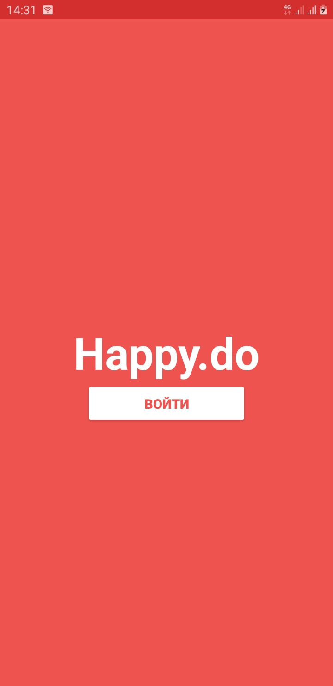
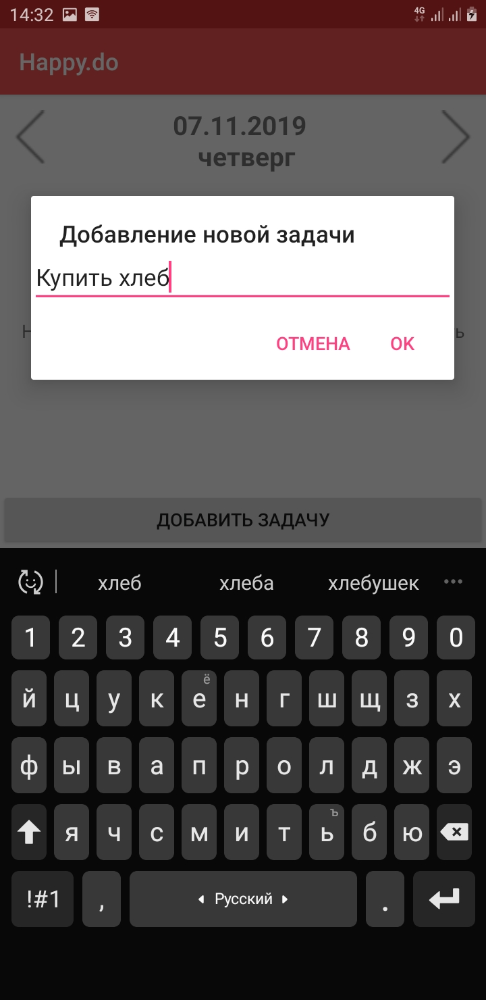
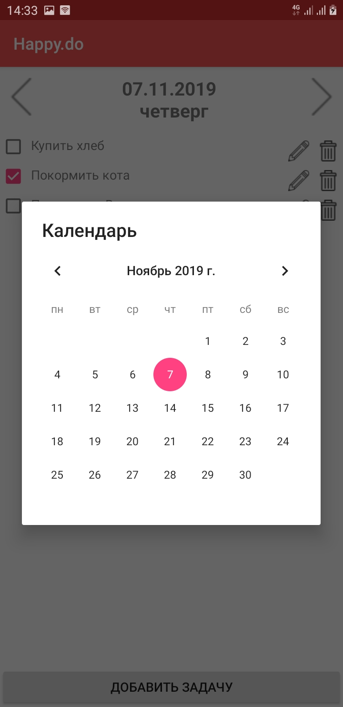

# Happy.do
Happy.do - это приложение - список задач для мобильных телефонов с ОС Android(поддерживается 4.4 и выше).
Храните свои дела и задачи в своём смартфоне, выполняйте их и будьте Happy.do!

# Экраны приложения

# Технологии
* Firebase Cloud Firestore
* Firebase RecyclerView
* Firebase Authentication 

